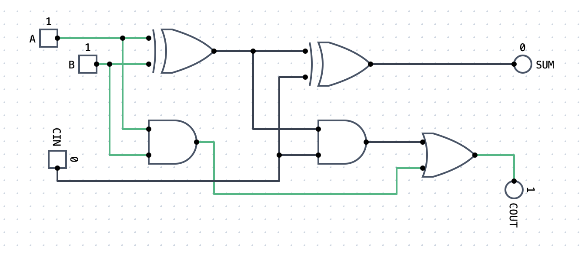

# Golden Gates



## Background

### What is it?

Golden Gates is a schematic circuit design tool intended to support CS 315 - Computer Architecture, at the University of San Francisco.

### Do we need another circuit simulator? 

1. We understand that many HDL projects exist, though most (Verilog, etc.) are more EE/CE-oriented than we intend. 
1. We intend to provide a modern, accessible tool to demystify the chain from compiler to microarchitecture, for an audience of Computer Science students. (that is, we don't calculate propagation delay)

### Long-term vision

We would like to include support for a (RISC-V) C compiler and machine code to the system, visually illustrating the path from C source code to microarchitecture.

### Non-goals

We would like to keep the door open to sythesizing student designs onto an FPGA. However, our current class projects are too complex to synthesize onto a reasonably-priced FPGA. 

## Usage

### The User Interface

1. Golden Gates has a minimalist user interface, where commands are grouped in the Command Palette, somewhat similar to VS Code or Spotlight.
1. To access the command palette, click on the Golden Gates icon at the upper left, or simply type "G" as a shortcut.
1. You can use autocomplete to type a few characters of the name of the command, or circuit component you want to insert. For example, type "xor" to insert an XOR gate.
1. You can use the clipboard to cut, copy, paste, and duplicate selected circuit components, using the standard keyboard shortcuts on your computer. Duplicate is Cmd-D on MacOS and Ctrl-D on Windows.
1. You can edit the properties of a circuit component using the property inspector on the right side of the app. For example, if you want an AND gate with four inputs, you can select an AND gate, and then modify its properties.
1. New subcircuits will appear as tabs in the the toolbar. For example, you can create subcircuits for an SR-Latch, save that as a Component, and then create a D-latch, where you can insert SR-Latches as subcircuits.
1. You can scroll/pan the circuit viewport using two-finger drag (if you have a trackpad) or scroll-wheel drag (if you have a mouse).

### Creating a Circuit

1. Start with Input and Output components to design your circuit
1. You can use any combination of logic gates, I/O, plexers, wires, memory, or arithmetic components to develop your circuit. We assume the specifications of your circuits are covered in a classroom similar to USF's Computer Architecture course.
1. Circuit components must be connected with wires between the output port(s) of one component and the input port(s) of other components.
1. You can create a junction (a wire whose source is another wire) by using the Option (on MacOS) or Alt (on Windows) key. Hold down that key and click on a wire to form a junction and start drawing the new wire.

### Running a Simulation

1. To run a simulation on a circuit you have drawn, choose Run from the command palette, or simply type "R" when the circuit area has keyboard focus.
1. Your output components will glow blue to indicate they have a value

### Working with Files

Since Golden Gates is a web app, it doesn't have direct access to the files on your computer's disk. However, you can upload and download files, with some variation by browser.

1. When you work with a circuit, your changes are stored in your browser's localStorage. This is safe and convenient to use, but you can't submit your browser's localStorage to GitHub for a grade.
1. To save a file to your computer's disk, use the Save command in the command palette, or simply type "S" when the circuit area has keyboard focus.
    1. On Chromium-based browsers (Chrome, Edge, Brave, Arc), this opens a File Save picker where you can choose the folder and filename for your project.
    1. On Safari and Firefox, saving your circuit makes a copy in the Downloads folder on your laptop. You'll have to move that file into your GitHub repo to get a grade.
1. To open a saved circuit, you can drag/drop the JSON file into the circuit area. Or you can use the Open command in the command palette. 
1. **Important** Golden Gates has no ability to save new updates to a previously-saved file. If you imagine the commands as "Save As" and "Save", Golden Gates has only "Save As".

### Working with Memory

Golden Gates contains a ROM component whose values can be loaded from a JSON file of this format:

    [
        0,
        255,
        "0xFF",
        "0b11111111",
        128,
        "0x80",
        "0b10000000",
        64,
        32,
        16,
        8,
        4,
        2,
        1,
        "0x00",
        "0b00000000"
    ]

## Development

If you want to develop for Golden Gates, the tool chain works like this:

### Front-End

1. The front-end is a [Vue.js](https://vuejs.org) app. You should be able to run it by
    1. Install node.js, and `npm install`
    1. run `npm run dev` to install the packages in the lockfile
    1. browse to localhost:3000 to run the single-page app
1. Changes to some JS/CSS components can be hot-reloaded using [vite](https://vite.dev). However, changes to GGL Python code require a restart of the server (CTRL-C and `npm run dev` again) due to pyodide's case.
1. Unit test cases are developed using [vitest](https://vitest.dev), and can be run automatically during development using `npm run test`
1. Human-readable strings are managed using `i18n` and locale files. New translations are welcome.
1. At this time, the whole system runs in the browser, with no server (or "server-less") software


### GGL

1. The simulation engine, GGL (Golden Gates Language) is a subset of Python, where the implementation supports the logical (non-presentation) part of circuit simulation
1. GGL was derived by feeding the spec for [Digital](https://github.com/hneemann/digital) through OpenAI O3 to get a [Python spec](https://github.com/phpeterson-usf/golden-gates/blob/main/gglang/design/ggl-design-o3-deep-research-v2.md)
1. Our GGL implementation can be unit-tested using our [autograder](https://github.com/phpeterson-usf/autograder) tool.
    ```text
    cd golden-gates/web/public/ggl
    grade test
    ```
    1. Autograder searches up the directory tree for [config.toml](https://github.com/phpeterson-usf/golden-gates/blob/main/web/public/ggl/config.toml), and uses that to find the [test case files](https://github.com/phpeterson-usf/golden-gates/blob/main/web/public/ggl/tests/ggl/ggl.toml). 
1. The execution environment for browser-side Python is [pyodide](https://pyodide.org/en/stable/), which is why we have no server-side software to deploy (or pay for).

### Deployment

1. All pushes to the `main` branch trigger a build on our [production deployment](https://golden-gates-nine.vercel.app) at Vercel.
1. Our project is configured to enforce CORS restrictions. See `vercel.json` for details.
